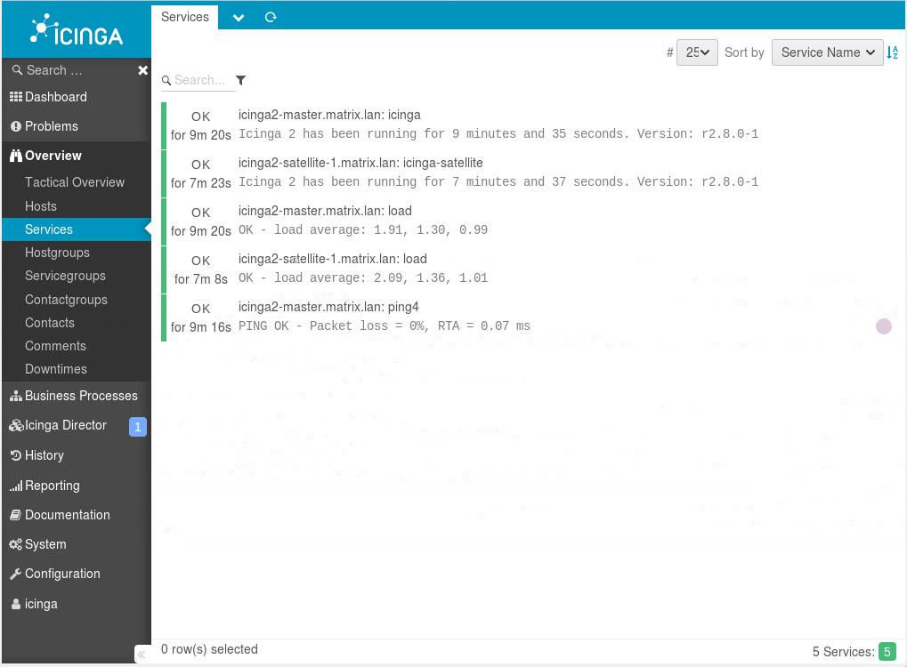

# docker-icinga2

creates several containers with different icinga2 characteristics:

- [icinga2](./build-from-source) created from the sourcecode
- icinga2 as [master](icinga2-master) with a certificats service
- icinga2 [satellite](icinga2-satellite)

---

# Status

[][hub]
[][microbadger]
[][travis]

[hub]: https://hub.docker.com/r/bodsch/docker-icinga2/
[microbadger]: https://microbadger.com/images/bodsch/docker-icinga2
[travis]: https://travis-ci.org/bodsch/docker-icinga2


# Build
You can use the included Makefile.
- To build the Container: `make`
- To remove the builded Docker Image: `make clean`
- Starts the Container: `make run`
- Starts the Container with Login Shell: `make shell`
- Entering the Container: `make exec`
- Stop (but **not kill**): `make stop`
- History `make history`

_You can specify an image version by using the `ICINGA2_VERSION` environment variable (This defaults to the "latest" tag)._

# Contribution
Please read [Contribution](CONTRIBUTIONG.md)

# Development,  Branches (Github Tags)
The `master` Branch is my *Working Horse* includes the "latest, hot shit" and can be complete broken!

If you want to use something stable, please use a [Taged Version](https://github.com/bodsch/docker-icinga2/tags) or an [Branch](https://github.com/bodsch/docker-icinga2/branches) like `1712` or `1801`

# side-channel / custom scripts
if use need some enhancements, you can add some (bash) scripts and add them via volume to the container:

```bash
--volume=/${PWD}/tmp/test.sh:/init/custom.d/test.sh
```

***This scripts will be started before everything else!***

***YOU SHOULD KNOW WHAT YOU'RE DOING.***

***THIS CAN BREAK THE COMPLETE ICINGA2 CONFIGURATION!***


# Availability
I use the official [Icinga2 packages](https://pkgs.alpinelinux.org/packages?name=icinga2&branch=&repo=&arch=&maintainer=) from Apline.

If one of them is removed, please contact Alpine and don't complain here!

I remove branches as soon as they are disfunctional (e. g. if a package is no longer available at Alpine). Not immediately, but certainly after 2 months.


# Docker Hub
You can find the Container also at  [DockerHub](https://hub.docker.com/r/bodsch/docker-icinga2/)


# Notices
The actuall Container Supports a stable MySQL Backand to store all needed Datas into it.

the graphite feature is **experimentally** and not conclusively tested.


## activated Icinga2 Features
- command
- checker
- mainlog
- notification
- graphite (only available if the environment variables are set)


# certificate service (**EXPERIMENTAL**)

[Sourcecode](https://github.com/bodsch/ruby-icinga-cert-service)

To connect a satellite to a master you need a certificate, which is issued by the master and signed by its CA.

The Icinga2 documentation provides more information about [Distributed Monitoring and Certificates](https://github.com/Icinga/icinga2/blob/master/doc/06-distributed-monitoring.md#signing-certificates-on-the-master-).

**I strongly recommend a study of the documentation!**

Within a docker environment this is a bit more difficult, so an external service is used to simplify this.
This service is constantly being developed further, but is integrated into the docker container in a stable version.

**The certificate service is only available at an Icinga2 Master!**

## usage

Certificate exchange is automated within the docker containers.
If you want to issue your own certificate, you can use the following API calls.

**You need a valid and configured API User in Icinga2.**

The certificate service requires the following environment variables:

- `ICINGA2_MASTER` (default: ``)
- `BASIC_AUTH_USER` (default: `admin`)
- `BASIC_AUTH_PASS` (default: `admin`)
- `ICINGA2_API_PORT` (default: `5665`)
- `ICINGA2_API_USER` (default: `root`)
- `ICINGA2_API_PASSWORD` (default: `icinga`)


### new way (since Icinga2 2.8)

You can use `expect` on a *satellite* or *agent* to create an certificate request with the *icinga2 node wizard*:

    expect /init/node-wizard.expect

After this, you can use the *cert-service* to sign this request:

    curl \
      --user ${ICINGA2_CERT_SERVICE_BA_USER}:${ICINGA2_CERT_SERVICE_BA_PASSWORD} \
      --silent \
      --request GET \
      --header "X-API-USER: ${ICINGA2_CERT_SERVICE_API_USER}" \
      --header "X-API-PASSWORD: ${ICINGA2_CERT_SERVICE_API_PASSWORD}" \
      --write-out "%{http_code}\n" \
      --output /tmp/sign_${HOSTNAME}.json \
      http://${ICINGA2_CERT_SERVICE_SERVER}:${ICINGA2_CERT_SERVICE_PORT}/v2/sign/${HOSTNAME}

After a restart of the Icinga2 Master the certificate is active and a secure connection can be established.


### old way (pre Icinga2 2.8)

To create a certificate:

    curl \
      --request GET \
      --user ${ICINGA2_CERT_SERVICE_BA_USER}:${ICINGA2_CERT_SERVICE_BA_PASSWORD} \
      --silent \
      --header "X-API-USER: ${ICINGA2_CERT_SERVICE_API_USER}" \
      --header "X-API-PASSWORD: ${ICINGA2_CERT_SERVICE_API_PASSWORD}" \
      --output /tmp/request_${HOSTNAME}.json \
      http://${ICINGA2_CERT_SERVICE_SERVER}:${ICINGA2_CERT_SERVICE_PORT}/v2/request/${HOSTNAME}

Extract the session checksum from the request above.

    checksum=$(jq --raw-output .checksum /tmp/request_${HOSTNAME}.json)

Download the created certificate:

    curl \
      --request GET \
      --user ${ICINGA2_CERT_SERVICE_BA_USER}:${ICINGA2_CERT_SERVICE_BA_PASSWORD} \
      --silent \
      --header "X-API-USER: ${ICINGA2_CERT_SERVICE_API_USER}" \
      --header "X-API-PASSWORD: ${ICINGA2_CERT_SERVICE_API_PASSWORD}" \
      --header "X-CHECKSUM: ${checksum}" \
      --output /tmp/${HOSTNAME}/${HOSTNAME}.tgz \
       http://${ICINGA2_CERT_SERVICE_SERVER}:${ICINGA2_CERT_SERVICE_PORT}/v2/cert/${HOSTNAME}


**The generated certificate has an timeout from 10 minutes between beginning of creation and download.**

You can also look into `rootfs/init/examples/use_cert-service.sh`

For Examples to create a certificate with commandline tools look into `rootfs/init/examples/cert-manager.sh`


# supported Environment Vars

**make sure you only use the environment variable you need!**

## database support

| Environmental Variable             | Default Value        | Description                                                     |
| :--------------------------------- | :-------------       | :-----------                                                    |
| `MYSQL_HOST`                       | -                    | MySQL Host                                                      |
| `MYSQL_PORT`                       | `3306`               | MySQL Port                                                      |
| `MYSQL_ROOT_USER`                  | `root`               | MySQL root User                                                 |
| `MYSQL_ROOT_PASS`                  | *randomly generated* | MySQL root password                                             |
| `IDO_DATABASE_NAME`                | `icinga2core`        | Schema Name for IDO                                             |
| `IDO_PASSWORD`                     | *randomly generated* | MySQL password for IDO                                          |

## create API User

| Environmental Variable             | Default Value        | Description                                                     |
| :--------------------------------- | :-------------       | :-----------                                                    |
| `ICINGA2_API_USERS`                | -                    | comma separated List to create API Users.<br>The Format are `username:password`<br>(e.g. `admin:admin,dashing:dashing` and so on)                  |

## support Carbon/Graphite

| Environmental Variable             | Default Value        | Description                                                     |
| :--------------------------------- | :-------------       | :-----------                                                    |
|                                    |                      |                                                                 |
| `CARBON_HOST`                      | -                    | hostname or IP address where Carbon/Graphite daemon is running  |
| `CARBON_PORT`                      | `2003`               | Carbon port for graphite                                        |

## support the Icinga Cert-Service

| Environmental Variable             | Default Value        | Description                                                     |
| :--------------------------------- | :-------------       | :-----------                                                    |
| `ICINGA2_MASTER`                   | -                    | The Icinga2-Master FQDN for a Satellite Node                    |
| `ICINGA2_PARENT`                   | -                    | The Parent Node for an Cluster Setup                            |
|                                    |                      |                                                                 |
| `BASIC_AUTH_USER`                  | `admin`              | both `BASIC_AUTH_*` and the `ICINGA2_MASTER` are importand, if you |
| `BASIC_AUTH_PASS`                  | `admin`              | use and modify the authentication of the *icinga-cert-service*  |
|                                    |                      |                                                                 |
| `CERT_SERVICE_BA_USER`             | `admin`              | The Basic Auth User for the certicate Service                   |
| `CERT_SERVICE_BA_PASSWORD`         | `admin`              | The Basic Auth Password for the certicate Service               |
| `CERT_SERVICE_API_USER`            | -                    | The Certificate Service needs also an API Users                 |
| `CERT_SERVICE_API_PASSWORD`        | -                    |                                                                 |
| `CERT_SERVICE_SERVER`              | `localhost`          | Certificate Service Host                                        |
| `CERT_SERVICE_PORT`                | `80`                 | Certificate Service Port                                        |
| `CERT_SERVICE_PATH`                | `/`                  | Certificate Service Path (needful, when they run behind a Proxy |

## notifications over SMTP

| Environmental Variable             | Default Value        | Description                                                     |
| :--------------------------------- | :-------------       | :-----------                                                    |
| `ICINGA2_SSMTP_RELAY_SERVER`       | -                    | SMTP Service to send Notifications                              |
| `ICINGA2_SSMTP_REWRITE_DOMAIN`     | -                    |                                                                 |
| `ICINGA2_SSMTP_RELAY_USE_STARTTLS` | -                    |                                                                 |
| `ICINGA2_SSMTP_SENDER_EMAIL`       | -                    |                                                                 |
| `ICINGA2_SSMTP_SMTPAUTH_USER`      | -                    |                                                                 |
| `ICINGA2_SSMTP_SMTPAUTH_PASS`      | -                    |                                                                 |
| `ICINGA2_SSMTP_ALIASES`            | -                    |                                                                 |

## activate some Demodata (taken from the official Icinga-Vagrant repository)

| Environmental Variable             | Default Value        | Description                                                     |
| :--------------------------------- | :-------------       | :-----------                                                    |
| `DEMO_DATA`                        | `false`              | copy demo data from `/init/demo-data` into `/etc/icinga2` config path |


# Icinga2 Master and Satellite

To connect a satellite to a master, the master must have activated the Cert service and the satellite must know how to reach it.

A docker-compose **example** could look like this:

```bash
---
version: '3.3'

networks:
  frontend:
  backend:
  database:
  satellite:

services:

  database:
    image: bodsch/docker-mysql:10.1.28-r1
    container_name: database
    hostname: database
    environment:
      - MYSQL_SYSTEM_USER=root
      - MYSQL_ROOT_PASS=vYUQ14SGVrJRi69PsujC
    volumes:
      - /etc/localtime:/etc/localtime:ro
      - /tmp/docker-data/database:/srv
    networks:
      - database

  # icingaweb2
  #
  icingaweb2:
    image: bodsch/docker-icingaweb2:latest
    container_name: icingaweb2
    hostname: icingaweb2.matrix.lan
    ports:
      - 80:80
    environment:
      - ICINGA2_HOST=icinga2-master.matrix.lan
      - MYSQL_HOST=database
      - MYSQL_ROOT_USER=root
      - MYSQL_ROOT_PASS=vYUQ14SGVrJRi69PsujC
      - ICINGA2_CMD_API_USER=root
      - ICINGA2_CMD_API_PASS=icinga
      - ICINGAWEB2_USERS=icinga:icinga,foo:bar
      - IDO_DATABASE_NAME=icinga2core
      - IDO_PASSWORD=qUVuLTk9oEDUV0A
    volumes:
      - /tmp/docker-data/icingaweb2:/srv
    links:
      - icinga2-master:icinga2-master.matrix.lan
      - database
    networks:
      - database
      - frontend
      - backend

  # the Icinga2 Master
  # includes a certificate service to create and provide a icinga certificate
  icinga2-master:
    build: icinga2-master
    container_name: icinga2-master
    hostname: icinga2-master.matrix.lan
    restart: always
    privileged: true
    ports:
      - 5665:5665
      - 8080:8080
    environment:
      - ICINGA2_API_USERS=root:icinga,dashing:dashing,cert:foo-bar
      - LOG_LEVEL=debug
      - MYSQL_HOST=database
      - MYSQL_ROOT_USER=root
      - MYSQL_ROOT_PASS=vYUQ14SGVrJRi69PsujC
      - IDO_PASSWORD=qUVuLTk9oEDUV0A
      # environment variables for the certificates service
      - ICINGA2_MASTER=icinga2-master.matrix.lan
      - BASIC_AUTH_USER=admin
      - BASIC_AUTH_PASS=admin
      - CERT_SERVICE_BA_USER=admin
      - CERT_SERVICE_BA_PASSWORD=admin
      - CERT_SERVICE_API_USER=root
      - CERT_SERVICE_API_PASSWORD=icinga
      - CERT_SERVICE_SERVER=icinga2-master
      - CERT_SERVICE_PORT=8080
      - CERT_SERVICE_PATH=/
      - CARBON_HOST=
      - CARBON_PORT=2003
      - DEMO_DATA=false
    volumes:
      - /etc/localtime:/etc/localtime:ro
#      - /tmp/docker-data/icinga2-master:/var/lib/icinga2
    links:
      - database
    extra_hosts:
      - dl-cdn.alpinelinux.org:192.168.0.20
    networks:
      - database
      - backend


  # the first icinga2 satellite
  # ask the master above for an certificate
  #
  # this satellite should work, the BA is correct
  icinga2-satellite-1:
    build: icinga2-satellite
    container_name: icinga2-satellite-1
    hostname: icinga2-satellite-1.matrix.lan
    restart: always
    privileged: true
    environment:
      - ICINGA2_MASTER=icinga2-master.matrix.lan
      - ICINGA2_PARENT=icinga2-master.matrix.lan
      - CERT_SERVICE_BA_USER=admin
      - CERT_SERVICE_BA_PASSWORD=admin
      - CERT_SERVICE_API_USER=root
      - CERT_SERVICE_API_PASSWORD=icinga
      - CERT_SERVICE_SERVER=icinga2-master.matrix.lan
      - CERT_SERVICE_PORT=8080
      - CERT_SERVICE_PATH=/
    volumes:
      - /etc/localtime:/etc/localtime:ro
    links:
      - icinga2-master:icinga2-master.matrix.lan
    networks:
      - backend
      - satellite
```

In this example I use my own docker containers:

- [database](https://hub.docker.com/r/bodsch/docker-mysql/builds/)
- [Icinga2](https://hub.docker.com/r/bodsch/docker-icinga2/builds/)
- [Icinga Web2](https://hub.docker.com/r/bodsch/docker-icingaweb2/builds/)

Please check for deviating tags at Docker Hub!

This example can be used as follows:

- `docker-compose up --build`

Afterwards you can see Icinga Web2 in your local browser at http://localhost.




